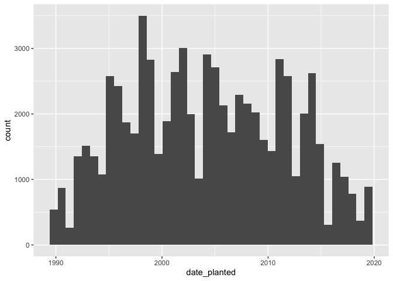

Mini Data-Analysis Deliverable 1
================

# Welcome to your (maybe) first-ever data analysis project\!

And hopefully the first of many. Let’s get started:

1.  Install the [`datateachr`](https://github.com/UBC-MDS/datateachr)
    package by typing the following into your **R terminal**:

<!-- -->

    install.packages("devtools")
    devtools::install_github("UBC-MDS/datateachr")

2.  Load the packages below.

<!-- end list -->

``` r
library(datateachr)
library(tidyverse)
```

    ## ── Attaching packages ─────────────────────────────────────── tidyverse 1.3.2 ──
    ## ✔ ggplot2 3.3.6      ✔ purrr   0.3.4 
    ## ✔ tibble  3.1.8      ✔ dplyr   1.0.10
    ## ✔ tidyr   1.2.1      ✔ stringr 1.4.1 
    ## ✔ readr   2.1.2      ✔ forcats 0.5.2 
    ## ── Conflicts ────────────────────────────────────────── tidyverse_conflicts() ──
    ## ✖ dplyr::filter() masks stats::filter()
    ## ✖ dplyr::lag()    masks stats::lag()

3.  Make a repository in the <https://github.com/stat545ubc-2022>
    Organization. You will be working with this repository for the
    entire data analysis project. You can either make it public, or make
    it private and add the TA’s and Lucy as collaborators. A link to
    help you create a private repository is available on the
    \#collaborative-project Slack channel.

# Instructions

## For Both Milestones

  - Each milestone is worth 45 points. The number of points allocated to
    each task will be annotated within each deliverable. Tasks that are
    more challenging will often be allocated more points.

  - 10 points will be allocated to the reproducibility, cleanliness, and
    coherence of the overall analysis. While the two milestones will be
    submitted as independent deliverables, the analysis itself is a
    continuum - think of it as two chapters to a story. Each chapter, or
    in this case, portion of your analysis, should be easily followed
    through by someone unfamiliar with the content.
    [Here](https://swcarpentry.github.io/r-novice-inflammation/06-best-practices-R/)
    is a good resource for what constitutes “good code”. Learning good
    coding practices early in your career will save you hassle later
    on\!

## For Milestone 1

**To complete this milestone**, edit [this very `.Rmd`
file](https://raw.githubusercontent.com/UBC-STAT/stat545.stat.ubc.ca/master/content/mini-project/mini-project-1.Rmd)
directly. Fill in the sections that are tagged with `<!--- start your
work below --->`.

**To submit this milestone**, make sure to knit this `.Rmd` file to an
`.md` file by changing the YAML output settings from `output:
html_document` to `output: github_document`. Commit and push all of your
work to the mini-analysis GitHub repository you made earlier, and tag a
release on GitHub. Then, submit a link to your tagged release on canvas.

**Points**: This milestone is worth 45 points: 43 for your analysis, 1
point for having your Milestone 1 document knit error-free, and 1 point
for tagging your release on Github.

# Learning Objectives

By the end of this milestone, you should:

  - Become familiar with your dataset of choosing
  - Select 4 questions that you would like to answer with your data
  - Generate a reproducible and clear report using R Markdown
  - Become familiar with manipulating and summarizing your data in
    tibbles using `dplyr`, with a research question in mind.

# Task 1: Choose your favorite dataset (10 points)

The `datateachr` package by Hayley Boyce and Jordan Bourak currently
composed of 7 semi-tidy datasets for educational purposes. Here is a
brief description of each dataset:

  - *apt\_buildings*: Acquired courtesy of The City of Toronto’s Open
    Data Portal. It currently has 3455 rows and 37 columns.

  - *building\_permits*: Acquired courtesy of The City of Vancouver’s
    Open Data Portal. It currently has 20680 rows and 14 columns.

  - *cancer\_sample*: Acquired courtesy of UCI Machine Learning
    Repository. It currently has 569 rows and 32 columns.

  - *flow\_sample*: Acquired courtesy of The Government of Canada’s
    Historical Hydrometric Database. It currently has 218 rows and 7
    columns.

  - *parking\_meters*: Acquired courtesy of The City of Vancouver’s Open
    Data Portal. It currently has 10032 rows and 22 columns.

  - *steam\_games*: Acquired courtesy of Kaggle. It currently has 40833
    rows and 21 columns.

  - *vancouver\_trees*: Acquired courtesy of The City of Vancouver’s
    Open Data Portal. It currently has 146611 rows and 20 columns.

**Things to keep in mind**

  - We hope that this project will serve as practice for carrying our
    your own *independent* data analysis. Remember to comment your code,
    be explicit about what you are doing, and write notes in this
    markdown document when you feel that context is required. As you
    advance in the project, prompts and hints to do this will be
    diminished - it’ll be up to you\!

  - Before choosing a dataset, you should always keep in mind **your
    goal**, or in other ways, *what you wish to achieve with this data*.
    This mini data-analysis project focuses on *data wrangling*,
    *tidying*, and *visualization*. In short, it’s a way for you to get
    your feet wet with exploring data on your own.

And that is exactly the first thing that you will do\!

1.1 Out of the 7 datasets available in the `datateachr` package, choose
**4** that appeal to you based on their description. Write your choices
below:

**Note**: We encourage you to use the ones in the `datateachr` package,
but if you have a dataset that you’d really like to use, you can include
it here. But, please check with a member of the teaching team to see
whether the dataset is of appropriate complexity. Also, include a
**brief** description of the dataset here to help the teaching team
understand your data.

<!-------------------------- Start your work below ---------------------------->

1: apt\_buildings

2: building\_permits

3: parking\_meters

4: vancouver\_trees

<!----------------------------------------------------------------------------->

1.2 One way to narrowing down your selection is to *explore* the
datasets. Use your knowledge of dplyr to find out at least *3*
attributes about each of these datasets (an attribute is something such
as number of rows, variables, class type…). The goal here is to have an
idea of *what the data looks like*.

*Hint:* This is one of those times when you should think about the
cleanliness of your analysis. I added a single code chunk for you below,
but do you want to use more than one? Would you like to write more
comments outside of the code chunk?

<!-------------------------- Start your work below ---------------------------->

``` r
### EXPLORE HERE ###
glimpse(apt_buildings) # returns dimension and every columns of a dataset
```

    ## Rows: 3,455
    ## Columns: 37
    ## $ id                               <dbl> 10359, 10360, 10361, 10362, 10363, 10…
    ## $ air_conditioning                 <chr> "NONE", "NONE", "NONE", "NONE", "NONE…
    ## $ amenities                        <chr> "Outdoor rec facilities", "Outdoor po…
    ## $ balconies                        <chr> "YES", "YES", "YES", "YES", "NO", "NO…
    ## $ barrier_free_accessibilty_entr   <chr> "YES", "NO", "NO", "YES", "NO", "NO",…
    ## $ bike_parking                     <chr> "0 indoor parking spots and 10 outdoo…
    ## $ exterior_fire_escape             <chr> "NO", "NO", "NO", "YES", "NO", NA, "N…
    ## $ fire_alarm                       <chr> "YES", "YES", "YES", "YES", "YES", "Y…
    ## $ garbage_chutes                   <chr> "YES", "YES", "NO", "NO", "NO", "NO",…
    ## $ heating_type                     <chr> "HOT WATER", "HOT WATER", "HOT WATER"…
    ## $ intercom                         <chr> "YES", "YES", "YES", "YES", "YES", "Y…
    ## $ laundry_room                     <chr> "YES", "YES", "YES", "YES", "YES", "Y…
    ## $ locker_or_storage_room           <chr> "NO", "YES", "YES", "YES", "NO", "YES…
    ## $ no_of_elevators                  <dbl> 3, 3, 0, 1, 0, 0, 0, 2, 4, 2, 0, 2, 2…
    ## $ parking_type                     <chr> "Underground Garage , Garage accessib…
    ## $ pets_allowed                     <chr> "YES", "YES", "YES", "YES", "YES", "Y…
    ## $ prop_management_company_name     <chr> NA, "SCHICKEDANZ BROS. PROPERTIES", N…
    ## $ property_type                    <chr> "PRIVATE", "PRIVATE", "PRIVATE", "PRI…
    ## $ rsn                              <dbl> 4154812, 4154815, 4155295, 4155309, 4…
    ## $ separate_gas_meters              <chr> "NO", "NO", "NO", "NO", "NO", "NO", "…
    ## $ separate_hydro_meters            <chr> "YES", "YES", "YES", "YES", "YES", "Y…
    ## $ separate_water_meters            <chr> "NO", "NO", "NO", "NO", "NO", "NO", "…
    ## $ site_address                     <chr> "65  FOREST MANOR RD", "70  CLIPPER R…
    ## $ sprinkler_system                 <chr> "YES", "YES", "NO", "YES", "NO", "NO"…
    ## $ visitor_parking                  <chr> "PAID", "FREE", "UNAVAILABLE", "UNAVA…
    ## $ ward                             <chr> "17", "17", "03", "03", "02", "02", "…
    ## $ window_type                      <chr> "DOUBLE PANE", "DOUBLE PANE", "DOUBLE…
    ## $ year_built                       <dbl> 1967, 1970, 1927, 1959, 1943, 1952, 1…
    ## $ year_registered                  <dbl> 2017, 2017, 2017, 2017, 2017, NA, 201…
    ## $ no_of_storeys                    <dbl> 17, 14, 4, 5, 4, 4, 4, 7, 32, 4, 4, 7…
    ## $ emergency_power                  <chr> "NO", "YES", "NO", "NO", "NO", "NO", …
    ## $ `non-smoking_building`           <chr> "YES", "NO", "YES", "YES", "YES", "NO…
    ## $ no_of_units                      <dbl> 218, 206, 34, 42, 25, 34, 14, 105, 57…
    ## $ no_of_accessible_parking_spaces  <dbl> 8, 10, 20, 42, 12, 0, 5, 1, 1, 6, 12,…
    ## $ facilities_available             <chr> "Recycling bins", "Green Bin / Organi…
    ## $ cooling_room                     <chr> "NO", "NO", "NO", "NO", "NO", "NO", "…
    ## $ no_barrier_free_accessible_units <dbl> 2, 0, 0, 42, 0, NA, 14, 0, 0, 1, 25, …

1.  After running glimpse(apt\_buildings), I know the number of rows in
    apt\_buildings is 3455. I also know the number of cols in
    apt\_buildings is 37. Meanwhile, I know the name and type of each
    variable in the apt\_buildings dataset.

<!-- end list -->

``` r
### EXPLORE HERE ###
head(building_permits) # returns the first 6 rows of building_permits
```

    ## # A tibble: 6 × 14
    ##   permit_nu…¹ issue_date proje…² type_…³ address proje…⁴ build…⁵ build…⁶ appli…⁷
    ##   <chr>       <date>       <dbl> <chr>   <chr>   <chr>   <chr>   <chr>   <chr>  
    ## 1 BP-2016-02… 2017-02-01       0 Salvag… 4378 W… <NA>    <NA>     <NA>   Raffae…
    ## 2 BU468090    2017-02-01       0 New Bu… 1111 R… <NA>    <NA>     <NA>   MAX KE…
    ## 3 DB-2016-04… 2017-02-01   35000 Additi… 3732 W… <NA>    <NA>     <NA>   Peter …
    ## 4 DB-2017-00… 2017-02-01   15000 Additi… 88 W P… <NA>    Mercur… "88 W … Aaron …
    ## 5 DB452250    2017-02-01  181178 New Bu… 492 E … <NA>    082016… "3559 … John H…
    ## 6 BP-2016-01… 2017-02-02       0 Salvag… 3332 W… <NA>    <NA>     <NA>   Shalin…
    ## # … with 5 more variables: applicant_address <chr>, property_use <chr>,
    ## #   specific_use_category <chr>, year <dbl>, bi_id <dbl>, and abbreviated
    ## #   variable names ¹​permit_number, ²​project_value, ³​type_of_work,
    ## #   ⁴​project_description, ⁵​building_contractor, ⁶​building_contractor_address,
    ## #   ⁷​applicant

``` r
dim(building_permits) # returns the dimension of building_permits
```

    ## [1] 20680    14

2.  After running head(building\_permits), I know the name and type of
    each variable in building\_permits and get the first 6 rows of
    building\_permits. After running dim(building\_permits), I know the
    number of rows in building\_permits is 20680 and the number of cols
    in building\_permits is 14.

<!-- end list -->

``` r
### EXPLORE HERE ###
class(parking_meters) # returns the overall structure of the data
```

    ## [1] "tbl_df"     "tbl"        "data.frame"

``` r
head(parking_meters) # returns the first 6 rows of parking_meters
```

    ## # A tibble: 6 × 22
    ##   meter_head  r_mf_9a_6p r_mf_…¹ r_sa_…² r_sa_…³ r_su_…⁴ r_su_…⁵ rate_…⁶ time_…⁷
    ##   <chr>       <chr>      <chr>   <chr>   <chr>   <chr>   <chr>   <chr>   <chr>  
    ## 1 Twin        $2.00      $4.00   $2.00   $4.00   $2.00   $4.00   <NA>    METER …
    ## 2 Pay Station $1.00      $1.00   $1.00   $1.00   $1.00   $1.00   $ .50   METER …
    ## 3 Twin        $1.00      $1.00   $1.00   $1.00   $1.00   $1.00   <NA>    METER …
    ## 4 Single      $1.00      $1.00   $1.00   $1.00   $1.00   $1.00   <NA>    METER …
    ## 5 Twin        $2.00      $1.00   $2.00   $1.00   $2.00   $1.00   <NA>    METER …
    ## 6 Twin        $2.00      $1.00   $2.00   $1.00   $2.00   $1.00   <NA>    METER …
    ## # … with 13 more variables: t_mf_9a_6p <chr>, t_mf_6p_10 <chr>,
    ## #   t_sa_9a_6p <chr>, t_sa_6p_10 <chr>, t_su_9a_6p <chr>, t_su_6p_10 <chr>,
    ## #   time_misc <chr>, credit_card <chr>, pay_phone <chr>, longitude <dbl>,
    ## #   latitude <dbl>, geo_local_area <chr>, meter_id <chr>, and abbreviated
    ## #   variable names ¹​r_mf_6p_10, ²​r_sa_9a_6p, ³​r_sa_6p_10, ⁴​r_su_9a_6p,
    ## #   ⁵​r_su_6p_10, ⁶​rate_misc, ⁷​time_in_effect

3.  After running class(parking\_meters), I know the class of
    parking\_meters is data.frame and “tbl” and “tbl\_df” are a modern
    taken on the parking\_meters data. After running
    head(parking\_meters), I know the name and type of each variable in
    parking\_meters and get the first 6 rows of parking\_meters.

<!-- end list -->

``` r
### EXPLORE HERE ###
head(vancouver_trees) # returns the first 6 rows of vancouver_trees
```

    ## # A tibble: 6 × 20
    ##   tree_id civic_number std_str…¹ genus…² speci…³ culti…⁴ commo…⁵ assig…⁶ root_…⁷
    ##     <dbl>        <dbl> <chr>     <chr>   <chr>   <chr>   <chr>   <chr>   <chr>  
    ## 1  149556          494 W 58TH AV ULMUS   AMERIC… BRANDON BRANDO… N       N      
    ## 2  149563          450 W 58TH AV ZELKOVA SERRATA <NA>    JAPANE… N       N      
    ## 3  149579         4994 WINDSOR … STYRAX  JAPONI… <NA>    JAPANE… N       N      
    ## 4  149590          858 E 39TH AV FRAXIN… AMERIC… AUTUMN… AUTUMN… Y       N      
    ## 5  149604         5032 WINDSOR … ACER    CAMPES… <NA>    HEDGE … N       N      
    ## 6  149616          585 W 61ST AV PYRUS   CALLER… CHANTI… CHANTI… N       N      
    ## # … with 11 more variables: plant_area <chr>, on_street_block <dbl>,
    ## #   on_street <chr>, neighbourhood_name <chr>, street_side_name <chr>,
    ## #   height_range_id <dbl>, diameter <dbl>, curb <chr>, date_planted <date>,
    ## #   longitude <dbl>, latitude <dbl>, and abbreviated variable names
    ## #   ¹​std_street, ²​genus_name, ³​species_name, ⁴​cultivar_name, ⁵​common_name,
    ## #   ⁶​assigned, ⁷​root_barrier

``` r
summary(vancouver_trees) # returns summary statistics of vancouver_trees
```

    ##     tree_id        civic_number    std_street         genus_name       
    ##  Min.   :    12   Min.   :    0   Length:146611      Length:146611     
    ##  1st Qu.: 65464   1st Qu.: 1306   Class :character   Class :character  
    ##  Median :134903   Median : 2604   Mode  :character   Mode  :character  
    ##  Mean   :131892   Mean   : 2937                                        
    ##  3rd Qu.:194450   3rd Qu.: 4005                                        
    ##  Max.   :266203   Max.   :17888                                        
    ##                                                                        
    ##  species_name       cultivar_name      common_name          assigned        
    ##  Length:146611      Length:146611      Length:146611      Length:146611     
    ##  Class :character   Class :character   Class :character   Class :character  
    ##  Mode  :character   Mode  :character   Mode  :character   Mode  :character  
    ##                                                                             
    ##                                                                             
    ##                                                                             
    ##                                                                             
    ##  root_barrier        plant_area        on_street_block  on_street        
    ##  Length:146611      Length:146611      Min.   :   0    Length:146611     
    ##  Class :character   Class :character   1st Qu.:1300    Class :character  
    ##  Mode  :character   Mode  :character   Median :2600    Mode  :character  
    ##                                        Mean   :2909                      
    ##                                        3rd Qu.:4000                      
    ##                                        Max.   :9900                      
    ##                                                                          
    ##  neighbourhood_name street_side_name   height_range_id     diameter     
    ##  Length:146611      Length:146611      Min.   : 0.000   Min.   :  0.00  
    ##  Class :character   Class :character   1st Qu.: 1.000   1st Qu.:  3.50  
    ##  Mode  :character   Mode  :character   Median : 2.000   Median :  9.00  
    ##                                        Mean   : 2.627   Mean   : 11.49  
    ##                                        3rd Qu.: 4.000   3rd Qu.: 16.50  
    ##                                        Max.   :10.000   Max.   :435.00  
    ##                                                                         
    ##      curb            date_planted          longitude         latitude    
    ##  Length:146611      Min.   :1989-10-27   Min.   :-123.2   Min.   :49.20  
    ##  Class :character   1st Qu.:1998-02-23   1st Qu.:-123.1   1st Qu.:49.23  
    ##  Mode  :character   Median :2004-01-28   Median :-123.1   Median :49.25  
    ##                     Mean   :2004-04-07   Mean   :-123.1   Mean   :49.25  
    ##                     3rd Qu.:2010-03-02   3rd Qu.:-123.1   3rd Qu.:49.26  
    ##                     Max.   :2019-07-03   Max.   :-123.0   Max.   :49.29  
    ##                     NA's   :76548        NA's   :22771    NA's   :22771

4.  After running head(vancouver\_trees), I know the name and type of
    each variable in vancouver\_trees and get the first 6 rows of
    vancouver\_trees. After running summary(vancouver\_trees), I know
    the min, 1st Qu, Median, Mean, 3rd Qu, and max statistics of each
    numerical variable in vancouver\_trees dataset.

<!----------------------------------------------------------------------------->

1.3 Now that you’ve explored the 4 datasets that you were initially most
interested in, let’s narrow it down to 2. What lead you to choose these
2? Briefly explain your choices below, and feel free to include any code
in your explanation.

<!-------------------------- Start your work below ---------------------------->

I will choose **apt\_buildings** and **vancouver\_trees** datasets. For
apt\_buildings dataset, it has both rich categorical and numerical
variables. Besides, the variables of apt\_buildings is easier to
understand for me. Hence, I think I can construct a variety of research
questions based on its diverse data. For vancouver\_trees dataset, it
has 146611 rows that is a really large dataset and I think a larger
amount of data would give a more accurate answer to the question.
Furthermore, I’m currently live in Vancouver, so I’m more interested in
the dataset that is close to my life.

<!----------------------------------------------------------------------------->

1.4 Time for the final decision\! Going back to the beginning, it’s
important to have an *end goal* in mind. For example, if I had chosen
the `titanic` dataset for my project, I might’ve wanted to explore the
relationship between survival and other variables. Try to think of 1
research question that you would want to answer with each dataset. Note
them down below, and make your final choice based on what seems more
interesting to you\!

<!-------------------------- Start your work below ---------------------------->

For apt\_buildings dataset, my research question is whether the type of
heating in the apartment changes with the year the house was built?

For vancouver\_trees dataset, my research question is what is the
relationship between the height of tree and the year it was planted?
Will a tree with a bigger year be higher?

My final decision is **vancouver\_trees** dataset, because I’m more
interested in the situation of tree in Vancouver.
<!----------------------------------------------------------------------------->

# Important note

Read Tasks 2 and 3 *fully* before starting to complete either of them.
Probably also a good point to grab a coffee to get ready for the fun
part\!

This project is semi-guided, but meant to be *independent*. For this
reason, you will complete tasks 2 and 3 below (under the **START HERE**
mark) as if you were writing your own exploratory data analysis report,
and this guidance never existed\! Feel free to add a brief introduction
section to your project, format the document with markdown syntax as you
deem appropriate, and structure the analysis as you deem appropriate.
Remember, marks will be awarded for completion of the 4 tasks, but 10
points of the whole project are allocated to a reproducible and clean
analysis. If you feel lost, you can find a sample data analysis
[here](https://www.kaggle.com/headsortails/tidy-titarnic) to have a
better idea. However, bear in mind that it is **just an example** and
you will not be required to have that level of complexity in your
project.

# Task 2: Exploring your dataset (15 points)

If we rewind and go back to the learning objectives, you’ll see that by
the end of this deliverable, you should have formulated *4* research
questions about your data that you may want to answer during your
project. However, it may be handy to do some more exploration on your
dataset of choice before creating these questions - by looking at the
data, you may get more ideas. **Before you start this task, read all
instructions carefully until you reach START HERE under Task 3**.

2.1 Complete *4 out of the following 8 exercises* to dive deeper into
your data. All datasets are different and therefore, not all of these
tasks may make sense for your data - which is why you should only answer
*4*. Use *dplyr* and *ggplot*.

1.  Plot the distribution of a numeric variable.
2.  Create a new variable based on other variables in your data (only if
    it makes sense)
3.  Investigate how many missing values there are per variable. Can you
    find a way to plot this?
4.  Explore the relationship between 2 variables in a plot.
5.  Filter observations in your data according to your own criteria.
    Think of what you’d like to explore - again, if this was the
    `titanic` dataset, I may want to narrow my search down to passengers
    born in a particular year…
6.  Use a boxplot to look at the frequency of different observations
    within a single variable. You can do this for more than one variable
    if you wish\!
7.  Make a new tibble with a subset of your data, with variables and
    observations that you are interested in exploring.
8.  Use a density plot to explore any of your variables (that are
    suitable for this type of plot).

<!-------------------------- Start your work below ---------------------------->

1.  Plot the distribution of the number of trees over years with
    histogram. (Finish exercise 1)

<!-- end list -->

``` r
tree_year_distribution <- ggplot(vancouver_trees, aes(date_planted)) + 
  geom_histogram(bins = 40) # use 40 bins in histogram
print(tree_year_distribution)
```

    ## Warning: Removed 76548 rows containing non-finite values (stat_bin).

<!-- -->

2.  Filter observations of trees that have diameter wider than 9 to get
    trees wider than half of all trees. (Finish exercise 5)

<!-- end list -->

``` r
# 9 is the median diameter
wide_vancouver_trees <- filter(vancouver_trees, diameter > 9) %>% # filter all trees that have diameter wider than 9
  select(diameter, everything()) %>% # move diameter variable as the first column
  arrange(diameter) # sort the rows by diameter in ascending order
head(wide_vancouver_trees) # print the first 6 rows of wide_vancouver_trees
```

    ## # A tibble: 6 × 20
    ##   diameter tree_id civic_number std_st…¹ genus…² speci…³ culti…⁴ commo…⁵ assig…⁶
    ##      <dbl>   <dbl>        <dbl> <chr>    <chr>   <chr>   <chr>   <chr>   <chr>  
    ## 1     9.1    40694          206 W 44TH … PRUNUS  CERASI… ATROPU… PISSAR… N      
    ## 2     9.1   223697          531 E 31ST … ACER    SPECIES <NA>    MAPLE … N      
    ## 3     9.15    6830         2516 W 7TH AV MAGNOL… KOBUS   <NA>    KOBUS … N      
    ## 4     9.2    62380         3249 W BROAD… TILIA   EUCHLO… <NA>    CRIMEA… N      
    ## 5     9.2   143959         3333 MAIN ST  TILIA   CORDATA <NA>    LITTLE… N      
    ## 6     9.2    41523          116 W 45TH … PRUNUS  CERASI… ATROPU… PISSAR… N      
    ## # … with 11 more variables: root_barrier <chr>, plant_area <chr>,
    ## #   on_street_block <dbl>, on_street <chr>, neighbourhood_name <chr>,
    ## #   street_side_name <chr>, height_range_id <dbl>, curb <chr>,
    ## #   date_planted <date>, longitude <dbl>, latitude <dbl>, and abbreviated
    ## #   variable names ¹​std_street, ²​genus_name, ³​species_name, ⁴​cultivar_name,
    ## #   ⁵​common_name, ⁶​assigned

3.  Make a new tibble with tree\_id, genus\_name, height\_range\_id,
    diameter and date\_planted. (Finish exercise 7)

<!-- end list -->

``` r
vancouver_trees_genus <- vancouver_trees %>%
  select(tree_id, genus_name, height_range_id, diameter, date_planted) %>% # select cols that I'm interested in
  arrange(genus_name) %>% # arrange the rows by genus_name
  drop_na(genus_name) # drop NA value in genus_name
head(vancouver_trees_genus) # print the first 6 rows of vancouver_trees_genus
```

    ## # A tibble: 6 × 5
    ##   tree_id genus_name height_range_id diameter date_planted
    ##     <dbl> <chr>                <dbl>    <dbl> <date>      
    ## 1  157429 ABIES                    7       31 NA          
    ## 2  222332 ABIES                    2        7 NA          
    ## 3  222339 ABIES                    3       10 NA          
    ## 4   30908 ABIES                    5       23 NA          
    ## 5   10709 ABIES                    3       12 NA          
    ## 6   11886 ABIES                    3        4 NA

4.  Use a density plot to explore the distribution of genus of trees
    over years. (Finish exercise 8)

<!-- end list -->

``` r
genus_distribution1 <- vancouver_trees_genus %>% 
  drop_na(date_planted) %>% # drop NA values in date_planted
  ggplot(aes(x = date_planted)) + 
  geom_density(aes(color = genus_name, fill = genus_name, alpha = 0.1)) # draw density of each genus in one plot
print(genus_distribution1)
```

    ## Warning: Groups with fewer than two data points have been dropped.
    ## Groups with fewer than two data points have been dropped.

    ## Warning in max(ids, na.rm = TRUE): no non-missing arguments to max; returning
    ## -Inf
    
    ## Warning in max(ids, na.rm = TRUE): no non-missing arguments to max; returning
    ## -Inf

<!-- -->

``` r
# Another way to draw the distribution of genus of trees over years
genus_distribution2 <- vancouver_trees_genus %>%
  drop_na(date_planted) %>%
  ggplot(aes(date_planted, genus_name)) + 
  ggridges::geom_density_ridges(bandwidth = 500) # parallel draw density of each genus 
print(genus_distribution2)
```

<!-- -->

<!----------------------------------------------------------------------------->

2.2 For each of the 4 exercises that you complete, provide a *brief
explanation* of why you chose that exercise in relation to your data (in
other words, why does it make sense to do that?), and sufficient
comments for a reader to understand your reasoning and code.

<!-------------------------- Start your work below ---------------------------->

1.  I am curious about the change in the number of trees planted each
    year. The distribution of number of trees over years can answer my
    question, which is related to the exercise 1. Histogram is useful to
    show the distribution of a continuous variable, so I choose it.

2.  From the summary statistics of diameter, I know the median diameter
    of all trees is 9. I’m interested in the trees that have diameter
    wider than 9, so they are wider than half of all trees. By filtering
    the trees that have diameter than 9 out, I can get my answer. Hence,
    it is related to exercise 5.

3.  I’m interested in tree\_id, genus\_name, height\_range\_id, diameter
    and date\_planted variables, so I select them and created a new
    tibble with those variables that related to exercise 7.

4.  I want to know how the number of trees planted in each genus varies
    with the year. Since the distribution of genus of trees can answer
    my question, I use the density plot to show the distribution, which
    is related to exercise 8. Besides, there are a lot kind of genus for
    trees, so I use two different density plot to find which shows
    better result.

<!----------------------------------------------------------------------------->

# Task 3: Write your research questions (5 points)

So far, you have chosen a dataset and gotten familiar with it through
exploring the data. Now it’s time to figure out 4 research questions
that you would like to answer with your data\! Write the 4 questions and
any additional comments at the end of this deliverable. These questions
are not necessarily set in stone - TAs will review them and give you
feedback; therefore, you may choose to pursue them as they are for the
rest of the project, or make modifications\!

<!--- *****START HERE***** --->

1.  Which genus of trees are most popular and which are planted the
    least in Vancouver?
2.  Which decade saw more trees planted in Vancouver?
3.  What is the relationship between the height of a tree and its age?
    Are older trees generally higher?
4.  Which genus of trees are more likely to be thicker?

# Task 4: Process and summarize your data (13 points)

From Task 2, you should have an idea of the basic structure of your
dataset (e.g. number of rows and columns, class types, etc.). Here, we
will start investigating your data more in-depth using various data
manipulation functions.

### 1.1 (10 points)

Now, for each of your four research questions, choose one task from
options 1-4 (summarizing), and one other task from 4-8 (graphing). You
should have 2 tasks done for each research question (8 total). Make sure
it makes sense to do them\! (e.g. don’t use a numerical variables for a
task that needs a categorical variable.). Comment on why each task helps
(or doesn’t\!) answer the corresponding research question.

Ensure that the output of each operation is printed\!

**Summarizing:**

1.  Compute the *range*, *mean*, and *two other summary statistics* of
    **one numerical variable** across the groups of **one categorical
    variable** from your data.
2.  Compute the number of observations for at least one of your
    categorical variables. Do not use the function `table()`\!
3.  Create a categorical variable with 3 or more groups from an existing
    numerical variable. You can use this new variable in the other
    tasks\! *An example: age in years into “child, teen, adult,
    senior”.*
4.  Based on two categorical variables, calculate two summary statistics
    of your choosing.

**Graphing:**

5.  Create a graph out of summarized variables that has at least two
    geom layers.
6.  Create a graph of your choosing, make one of the axes logarithmic,
    and format the axes labels so that they are “pretty” or easier to
    read.
7.  Make a graph where it makes sense to customize the alpha
    transparency.
8.  Create 3 histograms out of summarized variables, with each histogram
    having different sized bins. Pick the “best” one and explain why it
    is the best.

Make sure it’s clear what research question you are doing each operation
for\!

<!------------------------- Start your work below ----------------------------->

1.  Which genus of trees are most popular and which are planted the
    least in Vancouver?

<!-- end list -->

``` r
# Implement 2.
# Computer the number of observations of each genus in genus_name (categorical variable).
genus_count <- vancouver_trees %>%
  select(genus_name) %>% # select only genus_name from vancouver_trees dataset
  group_by(genus_name) %>% # group rows by genus_name
  mutate(count = n()) %>% # add a new column to count the number of each genus
  arrange(count) %>% # arrange rows by count in ascending order
  distinct() # delete duplicated rows
genus_count
```

    ## # A tibble: 97 × 2
    ## # Groups:   genus_name [97]
    ##    genus_name          count
    ##    <chr>               <int>
    ##  1 KALOPANAX               1
    ##  2 HALESIA                 1
    ##  3 ALBIZIA                 1
    ##  4 OXYDENDRUM              2
    ##  5 MICHELIA                2
    ##  6 CUPRESSOCYPARIS   X     2
    ##  7 EUCALYPTUS              2
    ##  8 CLERODENDRON            2
    ##  9 PTEROSTYRAX             3
    ## 10 SCIADOPITYS             3
    ## # … with 87 more rows

It helps answer the question. The ACER (36062 is the largest) is the
most popular and KALOPANAX, HALESIA and ALBIZIA are planted the least (1
is the least).

``` r
# Implement 5.
# Use a bar plot to show number of each genus and use vertical lines to help determine the accurate number.
genus_bar <- ggplot(vancouver_trees, aes(x = genus_name)) + 
  geom_bar(color = "black", fill = "white") + # geom_bar layer
  geom_hline(yintercept = seq(from = 0, to = 36000, by = 3000), color = "blue", linetype = "dashed", size = 1) + # geom_hline layer
  coord_flip() # flip the plot
print(genus_bar)
```

<!-- -->

It helps answer the question. The ACER has the longest bar, which mean
it’s most popular. The KALOPANAX, HALESIA and ALBIZIA have the shortest
bar, which means they are planted the least.

2.  Which decade saw more trees planted in Vancouver?

<!-- end list -->

``` r
# Implement 3.
# The range of year in vancouver_trees is from 1989 to 2019. Create year_period (new categorical variable) as a new col that contains 3 decades with date_planted variable (existing numerical variable).
# Use height_years_trees to help count number of trees in each decade. 
height_years_trees <- vancouver_trees %>% 
  select(height_range_id, date_planted) %>% # select height_range_id and date_planted variables from vancouver_trees
  # create a new column to count number of trees that planted in each decade
  # assign 1989~1999 label to trees planed in this range
  # assign 2000~2010 label to trees planed in this range
  # assign 2011~2019 label to trees planed in this range
  mutate(year_period = ifelse(date_planted <= '1999-12-31', "1989~1999", 
                       ifelse(date_planted >= '2000-1-1' & date_planted <= '2010-12-31', "2000~2010", 
                       ifelse(date_planted >= '2011-1-1', "2011~2019", NA))))
height_years_trees
```

    ## # A tibble: 146,611 × 3
    ##    height_range_id date_planted year_period
    ##              <dbl> <date>       <chr>      
    ##  1               2 1999-01-13   1989~1999  
    ##  2               4 1996-05-31   1989~1999  
    ##  3               3 1993-11-22   1989~1999  
    ##  4               4 1996-04-29   1989~1999  
    ##  5               2 1993-12-17   1989~1999  
    ##  6               2 NA           <NA>       
    ##  7               3 1993-12-16   1989~1999  
    ##  8               3 1993-12-16   1989~1999  
    ##  9               2 1993-12-16   1989~1999  
    ## 10               2 1993-12-03   1989~1999  
    ## # … with 146,601 more rows

``` r
# Count the number of trees in each decade based on height_years_trees dataset.
decades_trees_count <- height_years_trees %>% 
  group_by(year_period) %>% # group rows by each decade
  mutate(count=n()) %>% # create new column to store the number of trees in each decade 
  arrange(count) %>% # arrange the rows by count in ascending order
  distinct(year_period, count) # delete duplicated rows
decades_trees_count
```

    ## # A tibble: 4 × 2
    ## # Groups:   year_period [4]
    ##   year_period count
    ##   <chr>       <int>
    ## 1 2011~2019   16148
    ## 2 1989~1999   22912
    ## 3 2000~2010   31003
    ## 4 <NA>        76548

It helps answer the question. The decade with the most number of trees
planted is 2000\~2010.

``` r
# Implement 8.
# Create 3 histograms and select different bins for them to find the best size.
# The 3 bins histogram can show the distribution of number of trees over years.
# 3 bins is the best option for answering the question, because we have 3 decades and it's easier to see which decade planted the most number of trees in 3 bins.
tree_distribution_bin1 <- ggplot(vancouver_trees, aes(date_planted)) +
  geom_histogram(bins = 3) + # 3 bins
  labs(x = "Year of planting", y = "Number of trees", title = "bins = 3") # add titles to the plot
print(tree_distribution_bin1)
```

    ## Warning: Removed 76548 rows containing non-finite values (stat_bin).

<!-- -->

``` r
# Implement 8.
# The 10 bins histogram can show the distribution of number of trees over years.
# It's harder to compare the number of trees in each decade with 10 bins.
tree_distribution_bin2 <- ggplot(vancouver_trees, aes(date_planted)) +
  geom_histogram(bins = 10) + # 10 bins
  labs(x = "Year of planting", y = "Number of trees", title = "bins = 10") # add titles to the plot
print(tree_distribution_bin2)
```

    ## Warning: Removed 76548 rows containing non-finite values (stat_bin).

<!-- -->

``` r
# Implement 8.
# The 50 bins histogram can show the distribution of number of trees over years.
# It's hardest to compare the number of trees in each decade with 50 bins.
tree_distribution_bin3 <- ggplot(vancouver_trees, aes(date_planted)) +
  geom_histogram(bins = 50) + # 50 bins
  labs(x = "Year of planting", y = "Number of trees", title = "bins = 50") # add titles to the plot
print(tree_distribution_bin3)
```

    ## Warning: Removed 76548 rows containing non-finite values (stat_bin).

<!-- -->

It helps answer the question. From histogram with 3 bins, we can easily
see the decade with the most number of trees planted is 2000\~2010.

3.  What is the relationship between the height of a tree and its age?
    Are older trees generally higher?

<!-- end list -->

``` r
# Implement 2.
# Compute the number of observations of each height id and each decade in height_range_id (categorical variable) and year_period (categorical variable). In each height range id, compare the number of trees in each decade.
height_trees_count <- height_years_trees %>% 
  group_by(height_range_id, year_period) %>% # group rows by height_range_id and year_period
  mutate(height_count = n()) %>% # create a new column to store the number of trees in each height range and decade
  distinct(height_range_id, year_period, height_count) %>% # delete duplicated rows
  arrange(height_range_id, year_period) # arrange rows by height_range_id and year_period in ascending order
height_trees_count
```

    ## # A tibble: 39 × 3
    ## # Groups:   height_range_id, year_period [39]
    ##    height_range_id year_period height_count
    ##              <dbl> <chr>              <int>
    ##  1               0 1989~1999              9
    ##  2               0 2000~2010             32
    ##  3               0 2011~2019             28
    ##  4               0 <NA>                 145
    ##  5               1 1989~1999           1145
    ##  6               1 2000~2010          18190
    ##  7               1 2011~2019          15288
    ##  8               1 <NA>                5336
    ##  9               2 1989~1999          14670
    ## 10               2 2000~2010           9328
    ## # … with 29 more rows

It helps answer the question. From height\_range\_id 2 to 6, trees
planted in 1989\~1999 are more than 2000\~2010 in each
height\_range\_id. Also, trees planted in 2000\~2010 are more than
2011\~2019 in each height\_range\_id. From last question, we know the
most number of trees planted was in 2000\~2010, so it’s more likely the
height of the tree was roughly positively correlated with its age. The
older trees are more likely to be higher than younger trees.

``` r
# Implement 7.
# Use point plot and set its alpha transparency to 0.1 to show the relationship between the height of a tree and its age.
height_pointplot <- ggplot(vancouver_trees) +
  geom_point(aes(x = date_planted, y = height_range_id), alpha = 0.1) # point plot and set alpha transparency to 0.1
print(height_pointplot)
```

    ## Warning: Removed 76548 rows containing missing values (geom_point).

<!-- -->

It helps answer the question. From point plot, we can see there are more
points in earlier years that means more higher trees are planted in
early years. Therefore, the height of the tree was roughly positively
correlated with its age.

4.  Which genus of trees are more likely to be thicker?

<!-- end list -->

``` r
# Implement 1.
# Use summary statistics of diameter to help determine which genus of trees are more likely to be thicker.
diameter_summary <- vancouver_trees %>%
  group_by(genus_name) %>% # group rows by genus_name
  drop_na(diameter) %>% # drop NA values
  # calculate min, Q1, median, mean, Q2, max and range of diameter
  summarise(min = min(diameter), Q1 = quantile(diameter, probs = 1/4), median = median(diameter), mean = mean(diameter), Q2 = quantile(diameter, probs = 3/4), max = max(diameter), range = max - mean)
diameter_summary
```

    ## # A tibble: 97 × 8
    ##    genus_name    min    Q1 median  mean    Q2   max  range
    ##    <chr>       <dbl> <dbl>  <dbl> <dbl> <dbl> <dbl>  <dbl>
    ##  1 ABIES           1  3     12    12.9  19.5   42.5  29.6 
    ##  2 ACER            0  3      8    10.6  15    317   306.  
    ##  3 AESCULUS        0 19     25    23.7  30     64    40.3 
    ##  4 AILANTHUS       3 15     19.5  15.9  20.4   21.5   5.62
    ##  5 ALBIZIA         6  6      6     6     6      6     0   
    ##  6 ALNUS           0 12     17.5  17.5  23.4   40    22.5 
    ##  7 AMELANCHIER     0  3      3     3.21  3     20    16.8 
    ##  8 ARALIA          3  4.31   6.12  6.81  8.62  12     5.19
    ##  9 ARAUCARIA       3  4.12   8.5  11.4  12.9   32    20.6 
    ## 10 ARBUTUS         6  7.75  17.5  18.4  28.5   33    14.6 
    ## # … with 87 more rows

It helps answer the question. From the summary statistics, especially
the max term can be seen that some genus tend to have wider diameter
like ACER, RHAMNUS, and STYRAX.

``` r
# Implement 7.
# Use point plot and set its alpha transparency to 0.2 to show which genus of trees are more likely to be thicker.
diameter_pointplot <- ggplot(vancouver_trees) +
  geom_point(aes(x = diameter, y = genus_name), alpha = 0.2) # point plot and set alpha transparency to 0.2
print(diameter_pointplot)
```

<!-- -->

It helps answer the question. There are only some points show really
further to 0 diameter, which is ACER, RHAMNUS, and STYRAX.

<!----------------------------------------------------------------------------->

### 1.2 (3 points)

Based on the operations that you’ve completed, how much closer are you
to answering your research questions? Think about what aspects of your
research questions remain unclear. Can your research questions be
refined, now that you’ve investigated your data a bit more? Which
research questions are yielding interesting results?

<!-------------------------- Start your work below ---------------------------->

I can basically answer my research questions based on my operations.

1.  From the number of observations of each genus in genus\_name and the
    bar plot, the KALOPANAX, HALESIA and ALBIZIA are planted the least
    and ACER is the most popular.

2.  Based on the height\_years\_trees dataset that I created from
    vancouver\_trees, I can count the number of trees in each decade.
    From the count and the histogram, we can find they planted the most
    number of trees in 2000\~2010.

3.  Trees planted in 1989\~1999 usually have more higher trees than
    2000\~2010 and trees planted in 2000\~2010 usually have more higher
    trees than 2011\~2019. Since we know there are more trees in
    2000\~2010 than 1989\~1999, it’s more likely that the height of
    trees is positively related to its age. From the point plot, we can
    get the same answer.

4.  From the summary statistics of diameter, the max diameter of each
    genus can especially show ACER, RHAMNUS, and STYRAX tend to have
    wider diameter than others. The point plot gives the same answer.

Aspects of research questions remain unclear:

Since there are a lot NA values in the vancouver\_tree dataset, the
answer I got based on the dataset could be wrong.

Improvement:

I think we can think of some research questions that the answers won’t
be changed before and after deleting the NA values.

The most interesting result:

I think the answer to the 3rd research question validates my idea that
older trees are usually higher than younger trees, which is the most
interesting result to me.

<!----------------------------------------------------------------------------->

### Attribution

Thanks to Icíar Fernández Boyano for mostly putting this together, and
Vincenzo Coia for launching.
